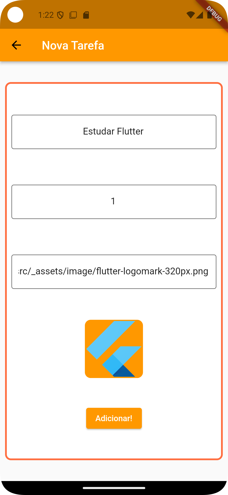

# Tasks App


## Descrição

**Tasks App** é um aplicativo mobile desenvolvido em Flutter que facilita a criação e o gerenciamento de tarefas do dia a dia. O aplicativo foi projetado para ajudar os usuários a organizar suas atividades, aumentando a produtividade e a eficiência na gestão do tempo.

### Funcionalidades

- **Adicionar Tarefas**: Crie novas tarefas facilmente com um título e descrição.
- **Listagem de Tarefas**: Visualize todas as suas tarefas em uma lista organizada.
- **Persistência de Dados**: Todas as tarefas são armazenadas localmente usando SQLite, garantindo que suas informações estejam sempre disponíveis.
- **Interface Amigável**: Design intuitivo que facilita a navegação e a interação.

## Tecnologias Utilizadas

- **Flutter**: Para desenvolvimento do aplicativo mobile.
- **Dart**: Linguagem de programação utilizada.
- **SQLite**: Banco de dados local para gerenciamento de tarefas.
- **Provider**: Para gerenciamento de estado.
- **Material Design**: Para uma interface moderna e responsiva.

## Demonstração



## Features Futuras

- **Autenticação de Usuário**: Implementar um sistema de login e registro para que os usuários possam ter suas tarefas sincronizadas em múltiplos dispositivos.
- **Compartilhamento de Tarefas**: Permitir que os usuários compartilhem tarefas com amigos ou familiares, facilitando a colaboração em projetos conjuntos.
- **Notificações Personalizadas**: Adicionar a capacidade de configurar lembretes personalizados para tarefas específicas.
- **Integração com Calendários**: Sincronizar tarefas com serviços de calendário, como Google Calendar ou Outlook, para uma melhor gestão de tempo.
- **Análise de Produtividade**: Criar uma seção para visualizar estatísticas de produtividade, mostrando tarefas concluídas, tempo gasto, e mais.
- **Modo Escuro**: Implementar um tema escuro para melhorar a usabilidade em ambientes com pouca luz.
- **Listas de Verificação**: Permitir que os usuários criem listas de verificação dentro das tarefas para um controle mais granular.
- **Edição de Tarefas**: Modifique detalhes de qualquer tarefa a qualquer momento.
- **Remoção de Tarefas**: Exclua tarefas que não são mais necessárias para manter sua lista organizada.
- **Filtros e Ordenação**: Organize suas tarefas com filtros por prioridade ou data de criação.
- **Notificações**: Receba lembretes sobre tarefas próximas do prazo.

## Pré-requisitos

- [Flutter](https://flutter.dev/docs/get-started/install) (instale seguindo as instruções de acordo com seu sistema operacional)
- [Dart](https://dart.dev/get-dart) (geralmente já incluído com o Flutter)

## Instalação

1. **Clone o repositório**:
   ```bash
   git clone https://github.com/gustavo-rebelo/Tasks.git
